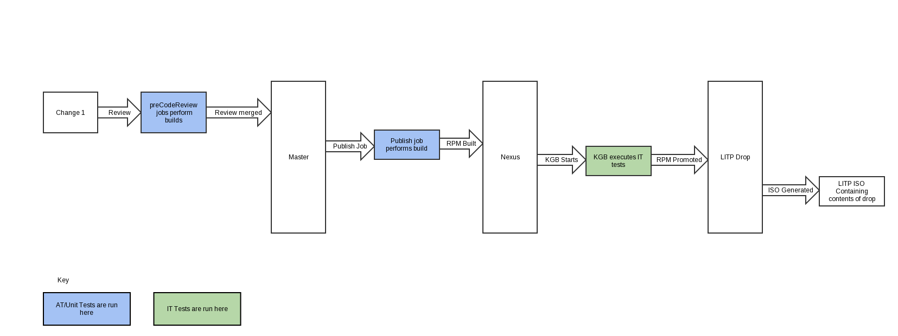

.. _AT Reports: https://fem111-eiffel004.lmera.ericsson.se:8443/jenkins/view/8_AT_Reports/
.. _Litp Developer Utility: http://confluence-nam.lmera.ericsson.se/display/ELITP/LDU%2B-%2BQuick%2BGuide%2Bfor%2BLocal%2BDevelopment

What Is ATRunner?
=================

The ATRunner is a tool which has two key functions:

- To provide a set of utilities used for writing AT tests.
- To provide the required environment and tools to run AT tests.

.. _ats-execute-label:

How Does ATRunner Execute Tests?
================================

ATRunner is designed to provide core-like behaviour for plugin testing. When a plugin runs an AT test, the ATRunner instantiates the specified version of core so that LITP-style commands can be executed. The parts of core which interact with external 3PPs (that is, Puppet feedback for running plans and Mco) are mocked.

The version of core that is instantiated depends on the Maven build command used and the dependency version information that is present in the POM file for that repo. By default, each repository is built against the minimum compatible version of core specified in its POM file. Building with the `latest-dep` profile will take the latest core version that has passed KGB.

How Are ATs Run?
================

ATs are run using the `Litp Developer Utility`_, from the root directory of a specific ERIClitp* repository.
To execute all ATs of a specific ERIClitp* repository, execute the following command:

.. code-block:: bash

    ldu runats

You can execute a single AT by specifying its path.

.. code-block:: bash

    ldu runats ats/testset_story9657/test_09_n_prepare_for_restore_remove_dependencies.at

What Are ATs?
=============

ATs are custom-written scripts which test LITP functionality in a lightweight manner (an AT test typically takes less than a second to run). Below is an example AT which tests ``litp create_plan`` and generates an error if you create a node item but don't provide any of the required details to define the node.

.. code-block:: bash

    ## create node without any links
    litp create -p /deployments/dep1 -t deployment
    litp create -p /deployments/dep1/clusters/cluster1 -t cluster
    litp create -p /deployments/dep1/clusters/cluster1/nodes/node1 -t node -o hostname=node1

    ## ensure error returned from create_plan
    assertError create_plan

ATs are stored in the ats folder at the top level of each repo.

When Are ATs Executed?
======================

The running of ATs is defined in the integration POM which is inherited by all LITP repos.

This means that if ATs are present within a repo, they are executed whenever that repo is built. If any of the AT tests fail, that build fails. Therefore any change submitted for code review is prevented from being merged if any AT fails. In addition, if an AT test fails during the execution of a Publish job, the corresponding RPM artefact will not be published.

Below is a diagram showing how a change gets to an ISO with colour coding showing what tests are run at different stages.

.. _AT-Report-label:

How Can I View a Report of the ATs That Have Run?
=================================================

Each time a repo is published, all its ATs are executed and must pass for the publish job to succeed. A downstream job, which generates a report of the ATs that have run, is configured for each publish job. Navigate to the Reports tab in Jenkins: `AT Reports`_ to view the reports for all the repos.

Who Maintains ATRunner?
=======================

A list of ATRunner guardians can be found at https://gerrit.ericsson.se/#/admin/groups/1387,members
