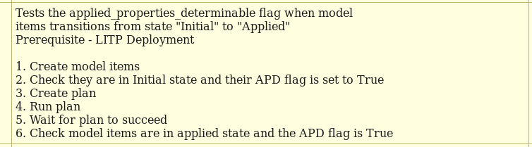

.. _Plugin SDK: https://arm1s11-eiffel004.eiffel.gic.ericsson.se:8443/nexus/content/sites/litp2/ERIClitpdocs/latest/plugin_sdk/acceptance_tests.html

How Do I Get Set Up to Run ATs?
===============================

ATs are run as part of the build process, so if your development environment has already been set up to build a repo with Maven, then your machine is already set up to run ATs.

Refer to `Plugin SDK`_ in the LITP SDK for a simplified setup which is focused on allowing the running of ATs.

What Are the AT Writing Conventions?
====================================

As some test cases for customer released stories are written as ATs, it is important that all teams follow the same naming and commenting convention. Follow the guidelines below when writing new ATs.

Folder Structure and Naming Conventions
---------------------------------------

All ATs must exist within the `ats/` directory of a plugin repo. If they are not present in this directory, they are not run when the repo is built.

Follow the guidelines below regarding the naming conventions for sub-directories:

When an AT Is Testing the Functionality of a Story
^^^^^^^^^^^^^^^^^^^^^^^^^^^^^^^^^^^^^^^^^^^^^^^^^^

When an AT is testing the functionality of a story, you must include it within a sub-directory which quotes the story number, as shown below:

.. code-block:: bash

    ERIClitp<repo_name>/ats/testset_story<story_number>/

So, for example, a test case AT for story TORF-107192 would exist in the following directory:

.. code-block:: bash

    ERIClitp<repo_name>/ats/testset_story107192/

For readability, traceability and maintainability reasons, ensure that only one test case exists for each AT.

Name the AT after the case it represents, as seen in the Test Case Design task in JIRA.

Ensure that the filename adheres to the following structure:

.. code-block:: bash

    test_<test_number>_<positive/negative>_<test_description>.at

For example, test case 1 for story TORF-107192 is named as follows:

.. code-block:: bash

    ERIClitp<repo_name>/ats/testset_story107192//test_01_p_create_plan_ddp_logs.at

ATs which are written for a story during development but which are not one of the test cases listed in JIRA can exist in a development sub-directory. One use case for this is story bugs, as shown in the example below:

.. code-block:: bash

    ERIClitp<repo_name>/ats/testset_story107192/development/story_bug_torf_107192.at

When an AT Is Testing a Bug Fix
^^^^^^^^^^^^^^^^^^^^^^^^^^^^^^^

A common use case for ATs is to add a new test after a bug is fixed to ensure the bug does not happen again. When doing this, put the AT in a directory which quotes the bug number, as shown below:

.. code-block:: bash

   ERIClitp<repo_name>/ats/testset_bug<bug_number>/

So, for example, an AT for bug TORF-107159 would exist in the following directory:

.. code-block:: bash

   ERIClitp<repo_name>/ats/testset_bug107159/

The name of the AT should begin with the word 'test' and have a name which represents the description of the bug that was fixed.

For example, a test case written for bug TORF-107159 may have the following name:

.. code-block:: bash

    ERIClitp<repo_name>/ats/testset_bug107159/test_create_plan_warning_logs.at

When an AT Is Providing Common Steps
^^^^^^^^^^^^^^^^^^^^^^^^^^^^^^^^^^^^

Reuse code wherever possible. Instead of copying common code blocks between ATs, include common commands in a separate AT file.

It is important that you name files that include steps common to several ATs with a `.inc` extension instead of a `.at` extension. This means it will not be run on its own when Maven builds the repo, but will only run in AT scripts that include it.

Store these common scripts in a misc directory within the sub-directory which makes use of them.

So, for example, a script which is used by a number of ATs for story TORF-107192 would have the following filename:

.. code-block:: bash

    ERIClitp<repo_name>/ats/testset_story107192/misc/create_multi_cluster_deployment.inc

Your AT scripts can then run these steps with the `runLitpScript` command as shown below:

.. code-block:: bash

    ##Run default deployment
    runLitpScript misc/create_multi_cluster_deployment.inc

    #Other AT commands below
    .
    .

Resources Used by ATs
^^^^^^^^^^^^^^^^^^^^^

Any plugins, extensions, Puppet manifests or XML files related to a specific test case should be contained within their respective sub-directories. For example, additional resources for story TORF-107192 should exist in the below directories:

.. code-block:: bash

    ERIClitp<repo_name>/ats/testset_story107192/plugins
    ERIClitp<repo_name>/ats/testset_story107192/extensions
    ERIClitp<repo_name>/ats/testset_story107192/manifests
    ERIClitp<repo_name>/ats/testset_story107192/xml

Plugins and their conf files should be contained in the `plugins` directory and extensions and their conf files in the `extensions` directory. Puppet manifests that are used for comparison (such as site.pp, node1.pp and ms.pp) must be located in the `manifests` directory. Any XML files used for the tests must be in the `xml` directory.

When creating custom dummy plugins and extensions for ATs, ensure that they contain the bug or story number to keep them unique. For example, plugin_9999.py or extension_9999.py and the same for the class names (see the :ref:`ldu-label` section below).

What Are the AT Commenting Conventions?
---------------------------------------

The AT reports mentioned in section :ref:`AT-Report-label` display the comments associated with each AT. An AT without comments cannot be easily understood.

Adhere to the following conventions on commenting in ATs:

#. Include a concise description of the overall test at the top of the AT.

#. Include a numbered comment describing the step being performed  above each logical block in an AT.

#. Specify the comments that you want to be included in the test report by starting the comments with '##' (see the example below). If you do not specify any comments for inclusion, then all comments are included in the report.

Below is an example AT with the expected level of comments:

.. code-block:: bash

    ## Tests the applied_properties_determinable flag when model
    ## items transitions from state "Initial" to "Applied"

    ## Prerequisite - LITP Deployment
    ## 
    runLitpScript ../include/two_nodes.at

    ## 1. Create model items
    litp create -p /software/items/telnet -t mock-package -o name=telnet
    litp inherit -p /ms/items/telnet -s /software/items/telnet

    # Dev comment - this will not appear in the report front page

    ## 2. Check they are in Initial state and their APD flag is set to True
    assertState -p /software/items/telnet Initial
    assertState -p /ms/items/telnet Initial
    assertAppliedPropertiesDeterminable -p /software/items/telnet True
    assertAppliedPropertiesDeterminable -p /ms/items/telnet True

    ## 3. Create plan
    litp create_plan

    ## 4. Run plan
    litp run_plan

    ## 5. Wait for plan to succeed
    assertPlanState successful

    # Dev comment - this will not appear in the report front page

    ## 6. Check model items are in applied state and the APD flag is True
    assertState -p /software/items/telnet Applied
    assertState -p /ms/items/telnet Applied
    assertAppliedPropertiesDeterminable -p /software/items/telnet True
    assertAppliedPropertiesDeterminable -p /ms/items/telnet True

Only the comments which start with '## ' in the example above are included in the Jenkins HTML report:

.. _ldu-label:

Enforcing Conventions With LDU
------------------------------

The LITP Developer Utility (LDU) has a command line tool for creating AT stubs. To create the stubs, execute the following command from within a LITP repository:

.. code-block:: bash

    ldu create_at_stub -s 12345 -e -p

Where:
  * ``-s`` is the JIRA ticket type (story or bug)
  * ``12345`` is the JIRA ticket number
  * ``-e`` is an option to create a dummy extension
  * ``-p`` is an option to create a dummy plugin

This tool automatically applies the naming conventions detailed in the previous section when creating the stubs. For further information on ``create_at_stub``, see the following help text:

.. code-block:: bash

    ldu create_at_stub --help

What Other Guidelines Do I Need to Follow?
------------------------------------------

Apply the following guidelines to all ATs:

#. Ensure that all the names of all files and sub-directories are in lower case.
#. Ensure that ATs do not contain the the words FIXME, TODO or similar. If functionality cannot be tested with an AT it should be an IT instead.
#. Do not comment out AT commands. Delete lines that you do not need.
